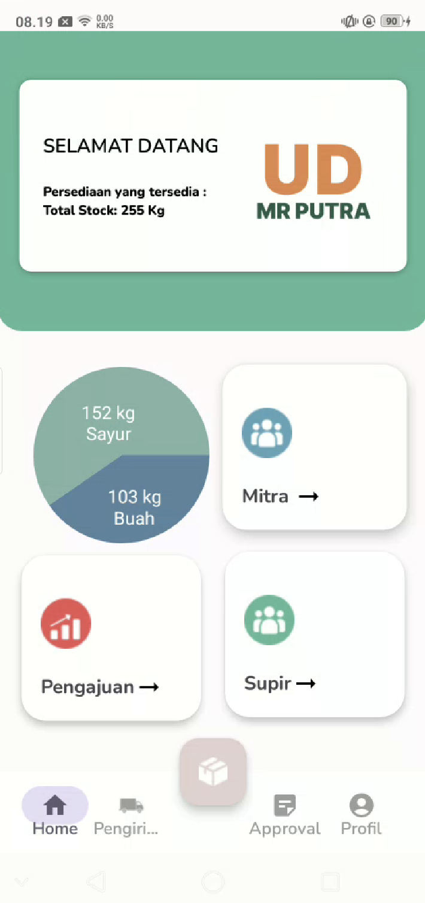
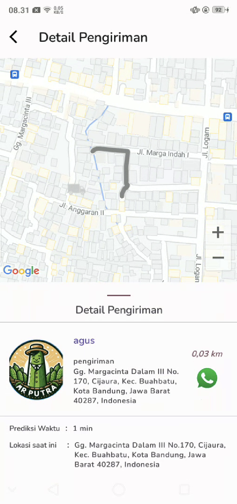
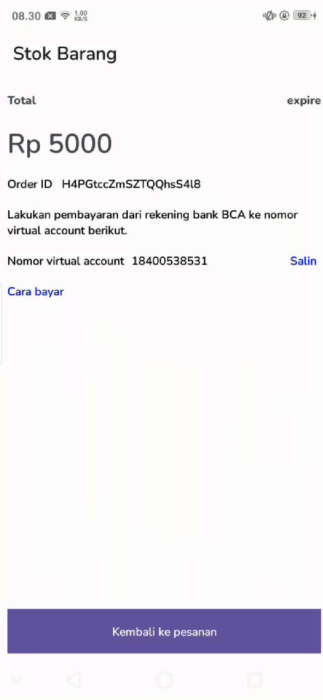

# IMPLEMENTASI SISTEM APLIKASI PENJUALAN SAYUR DAN BUAH  (STUDI KASUS : UD MR PUTRA)

Kami berencana untuk membuat sebuah perangkat lunak berbasis Android sebagai alat pendorong kemajuan teknologi bagi UD MR Putra dalam menjalankan usahanya dengan menggunakan beberapa teknologi di dalamnya seperti Google Maps API yang digunakan untuk menginformasikan lokasi dari sayur dan buah buahan yang dikirim. Dan juga membuatkan sistem pencatatan barang dan keuangan untuk mempermudah dalam mengelola barang maupun keuangan dan juga aplikasi ini akan memfasilitasi koneksi antara mitra bisnis dengan UD MR Putra, membantu memperluas jaringan dan memperkuat kolaborasi di dalam industri yang dinamis ini. Dengan perangkat lunak ini, kami bertujuan untuk membantu UD MR Putra mengoptimalkan operasinya dan memasuki era baru dalam teknologi bisnis mereka.

Tampilan Admin                              | Tampilan Tracking                          | Tampilan Pembayaran
--------------------------------------------|--------------------------------------------|--------------------------------------------
||

### Link Berkas PA

(diisi link Google Drive kelompok PA yang telah disiapkan oleh Tim PA)

### Susunan Tim

Nama|Username Github|Posisi
---|---|---
Amir Hasanudin Fauzi||Pembimbing
Indra Azimi|indraazimi|Reviewer
Fadly Ramdhani|fadlyramdhani23|Mahasiswa
Muhamad Rizki Mardiansyah|rizkimardii|Mahasiswa
